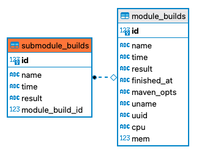
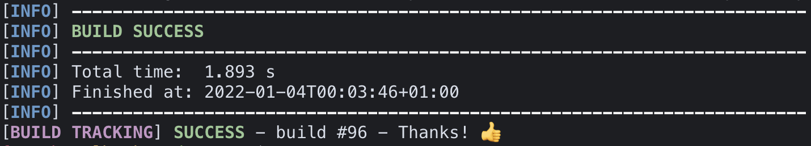

# Maven Bulid Tracker

This project bundles a [shell script](track.sh) and an API build with [FastAPI](https://github.com/tiangolo/fastapi), [SQLAlchemy](https://github.com/sqlalchemy/sqlalchemy), [SQLite](https://github.com/sqlite/sqlite) 
to read, parse and collect maven build output.

## Why? What can you do with the collected data?

The original intent was to collect data that will give you an idea of **costs caused by builds**.  
The data will of course allow you to draw some other conclusions as well.

For example, reducing build times will increase the possibility for developers to keep their focus on the current task.  
During long build times developers might [get distracted... or frustrated.](https://www.google.com/search?q=multitasking+myth) 

Findings will help you to argue for

- upgrading systems used by developers
- increasing the number of build machines in CI/CD pipelines
- changing the software architecture
- using different maven build options during development
- changing developer workflows

## Collected Data

Raw data read from system interfaces and Maven build output.

| Field | Description | Example |
| --- | --- | --- |
| module | Maven project name | Example 0.0.1-SNAPSHOT |
| result | build result | SUCCESS |
| build_time | build time | 30.010s |
| finished_at | ISO 8601 timestamp of build | 2022-01-01T15:52:00+01:00 |
| maven_opts | Maven build options read from $MAVEN_OPTS | -XX:+TieredCompilation -XX:TieredStopAtLevel=1 |
| uname | os of build system | Darwin |
| uuid | UUID to identifies system | a4eaaf3f-2be2-4423-bb99-49140412f39c |
| cpu | CPU of build system | Intel(R) Pentium(R) CPU G4600T @ 3.00GHz |
| mem | max. memory of build system in GB | 32 |
| submodules | list of submodules | see example down below |

## Example of data send to API

```json
{
    "module": "Example 0.0.1-SNAPSHOT",
	"result": "SUCCESS",
	"build_time": "3.177s",
	"finished_at": "2022-01-01T15:52:00+01:00",
	"maven_opts": "-XX:+TieredCompilation -XX:TieredStopAtLevel=1",
	"uname": "Darwin",
	"uuid": "a4eaaf3f-2be2-4423-bb99-49140412f39c",
	"cpu": "Intel(R) Pentium(R) CPU G4600T @ 3.00GHz",
	"mem": 32,
	"submodules": [
		{
			"module": "Submodule A",
			"build_time": "0.666s",
			"result": "SUCCESS"
		},
		{
			"module": "Submodule B",
			"build_time": "2.511s",
			"result": "SUCCESS"
		}
    ]
}
```
## DB Layout


## Usage

1. **Deploy and start API**  
Have [SQLite](https://github.com/sqlite/sqlite) and Python 3.7+ installed.  
The SQlLte database is setup automatically on first start.
```sh
python -m venv venv
source venv/bin/activate
pip install -r requirements.txt
uvicorn Main:app
```
2. **Setup build tracking**  
Set path to API in [track.sh](track.sh)  
and make [track.sh](track.sh) executable
```sh
BUILD_TRACKER="http://127.0.0.1:8000/build"
```
```sh
chmod u+x track.sh
```
3. **Run Maven build**  
```sh
mvn clean install | ./track.sh
# Or use 'script' to preserve Mavens colorful output.
# Syntax may differ on your platform. This works on MacOS.
script -q /dev/null mvn clean install | ./track.sh
```

## Limitations

* Linux doesn't necessarily provide a unique system UUID without optional software or root access.  
A random UUID will be generated and stored in *~/.build_tracker*.
* Currently system CPU and memory informations will only be collected on Darwin/MacOS and Linux systems,  
but not on Windows. It should work fine on WSL, though.
* Options directly given to Maven are not recognized.
* **Based on trust**. There is no real data validation.  
If developers decide to send bogus data, it has to be handled in evaluation step.  
This tool merly collects raw data.

## License

This project is licensed under the terms of the [MIT license](<https://www.opensource.org/licenses/mit-license.php>).  
